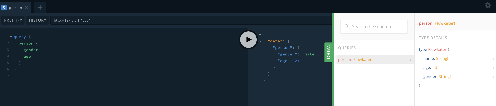

# GraphQL 백엔드 만들기 (Graphql-yoga)

## 목적

GraphQL 백엔드 만들기

## 프로젝트 셋업

    mkdir movieql
    yarn init
    yarn add graphql-yoga

## Api

- Over-fetching

    /users/:id GET (User Info)

- user 의 프로필 이미지 주소만 필요한데, 위 api 를 통해서 user 의 전체 정보를 불러오는 것
- 불필요한 정보를 주고받게 되며 백엔드에서는 클라이언트에서 어떤 정보를 원하는지 알 수가 없다.

- Under-fetching

    /feed/
    /notifications/
    /users/:id

- 앱을 런칭하는 시점에 여러 api 를 동시에 호출하는 방법
- 위 예 처럼 feed, notifications, users/:id 등 다양하게 api를 호출하게 되어 end-point 가 복잡해지고 관리가 힘들어진다.

- graphql
```graphql
    /api 하나의 종점
    
    # Request
    {
    	feed {
    		comments
    		likeNumber
    	}
    	notifications {
    		isRead
    	}
    
    	user {
    		username
    		profilePic
    	}
    }
    
    # Json Response
    {
    	feed: [
    		{
    			comments:1,
    			likeNumber: 20
    		}
    	],
    	notifications: [
    		{
    			isRead: true
    		},
    		{
    			isRead: false
    		}
    	],
    	user: {
    		username: 'kater'
    		profilePic: '/profile_kater.png'
    	}
    }
```
- 하나의 End-Point에  Request 를 위처럼 보내면 내가 필요한 정보만 Json Response 로 받을 수 있다.

## 서버 세팅
```shell
    yarn add nodemon # 서버 실행
    yarn add babel-cli babel-preset-env babel-preset-stage-3 --dev # ES6 사용
```

```json
    // pacakage.json
    {
      "name": "movieql",
      "version": "1.0.0",
      "main": "index.js",
      "license": "MIT",
      "dependencies": {
        "graphql-yoga": "^1.15.0",
        "nodemon": "^1.18.3"
      },
      "scripts": {
        "start": "nodemon --exec babel-node index.js"
      },
      "devDependencies": {
        "babel-cli": "^6.26.0",
        "babel-preset-env": "^1.7.0",
        "babel-preset-stage-3": "^6.24.1"
      }
    }

    // .babelrc
    {
      "presets": [
        "env",
        "stage-3"
      ]
    }
```
```javascript
    // index.js 
    import { GraphQLServer } from "graphql-yoga";
    const server = new GraphQLServer({});
    server.start(() => console.log("Graphql Server Running"));
    // No schema Defined 에러 발생
```
## GraphQL 스키마 셋업

- graphql/schema.graphql
```graphql
    type Query {
      name: String!
    }
```
- 스키마는 일종의 데이터 매핑 정의
  - Query 는 데이터를 Get 가져올때 type Query
  - Mutation 은 데이터를 변경할때 type Mutation
  - Subscriptions (설명)

- graphql/resolvers.js
```javascript
    const resolvers = {
      Query: {
        name: () => "flowkater"
      }
    }
    
    export default resolvers;
```
- resolvers 는 스키마에서 연결된 쿼리에 직접적으로 반환하는 함수
  - 여기서 데이터베이스에 직접 연결을 하거나 다른 API 서버에 연결하는 등의 작업을 할 수가 있다.

- index.js
```javascript
    import { GraphQLServer } from "graphql-yoga";
    import resolvers from "./graphql/resolvers";
    
    
    const server = new GraphQLServer({
      typeDefs: "graphql/schema.graphql",
      resolvers
    });
    
    server.start(() => console.log("Graphql Server Running"));
```
```json
    yarn start
    # -> localhost:4000 들어가보면 graphql-yoga 클라이언트를 확인가능
    query {
    	name
    }
    # 위로 쏘면 
    {
    	"data" : {
    		"name": "flowkater"
    	}
    }
    
    # 리턴
```


## 객체를 반환하기

- graphql/schema.graphql
```graphql
    type Flowkater {
      name: String!
      age: Int!
      gender: String!
    }
    
    type Query {
      person: Flowkater!
    }
```
- Schema에 데이터 타입을 정의할 수 있음
  - ! 는 required
```javascript
- graphql/resolvers.js

    const flowkater = {
      name: "Flowkater",
      age: 27,
      gender: "male"
    }
    
    const resolvers = {
      Query: {
        person: () => flowkater
      }
    }
    
    export default resolvers;
```
- 일종의 데이터 소스, 위에서 말한 것처럼 데이터베이스(또는 외부 api)로 연결 가능

- 객체 안에 필수적으로 원하는 쿼리를 던져야 함. 필요한 정보만 가져올 수 있다.



## 객체 배열 반환

- graphql/schema.graphql
```graphql
    type Person {
      id: Int!
      name: String!
      age: Int!
      gender: String!
    }
    
    type Query {
      people: [Person]!
      person(id: Int!): Person
    }
```
- graphql/resolvers.js
```javascript
    import { people, getById } from "./db";
    
    const resolvers = {
      Query: {
        people: () => people,
        person: () => getById
      }
    }
    
    export default resolvers;
```
- graphql/db.js
```javascript
    export const people = [
      {
        id: 0,
        name: "Flowkater",
        age: 27,
        gender: "male"
      },
      {
        id: 1,
        name: "Ryan",
        age: 25,
        gender: "male"
      },
      {
        id: 2,
        name: "Duke",
        age: 26,
        gender: "male"
      },
      {
        id: 3,
        name: "Kong",
        age: 24,
        gender: "female"
      }
    ]
    
    export const getById = id => {
      const filteredPeople = people.filter(person => people.id === id);
      return filteredPeople[0];
    }
```


## Query with Arguments
```javascript
    import { people, getById } from "./db";
    
    const resolvers = {
      Query: {
        people: () => people,
        person: (_, { id }) => getById(id)
      }
    }
    
    export default resolvers;
```
- _ 이 인자를 쓰지 않겠다. (parent, args)


## Mutation (영화 api 로 변경)
```graphql
    // schema.graphql
    ... 
    type Mutation {
      addMovie(name: String!, score: Int!): Movie!
      deleteMovie(id: Int!): Boolean!
    }
```
```javascript
    // db.js
    ...
    export const deleteMovie = id => {
      const cleanedMovies = movies.filter(movie => movie.id !== id);
      if(movies.length > cleanedMovies.length) {
        movies = cleanedMovies;
        return true;
      } else {
        return false;
      }
    }
    
    export const addMovie = (name, score) => {
      const newMovie = {
        id: `${movies.length + 1}`,
        name,
        score
      }
      movies.push(newMovie);
      return newMovie;
    }
```
```javascript
    // resolvers.js
    ...
      Mutation: {
        addMovie: (_, { name, score }) => addMovie(name, score),
        deleteMovie: (_, { id }) => deleteMovie(id)
      }
```


## Additional API
```graphql
    // schema.graphql
    type Movie {
      id: Int!
      title: String!
      rating: Float!
      summary: String!
      leanguage: String!
      medium_cover_image: String!
      description_intro: String!
    }
    
    type Query {
      movies(limit: Int, rating: Float): [Movie]!
      movie(id: Int!): Movie
      suggestions(id: Int!): [Movie]!
    }
```
```javascript
    // resolvers.js
    import { getMovies, getMovie, getSuggestions } from "./db";
    
    const resolvers = {
      Query: {
        movies: (_, { limit, rating}) => getMovies(limit, rating),
        movie: (_, { id }) => getMovie(id),
        suggestions: (_, { id }) => getSuggestions(id)
      }
    }
    
    export default resolvers;
```
```javascript
    // db.js
    import axios from "axios";
    const BASE_URL = "https://yts.am/api/v2";
    const LIST_MOVIES_URL = `${BASE_URL}/list_movies.json`;
    const MOVIE_DETAILS_URL = `${BASE_URL}/movie_details.json`;
    const MOVIE_SUGGESTIONS_URL = `${BASE_URL}/movie_suggestions.json`;
    
    export const getMovies = async (limit, rating) => {
      const {
        data: {
          data: { movies }
        }
      } = await axios(LIST_MOVIES_URL, {
        params: {
          limit,
          minimum_rating: rating
        }
      });
    
      return movies;
    };
    
    export const getMovie = async id => {
      const {
        data: {
          data: { movie }
        }
      } = await axios(MOVIE_DETAILS_URL, {
        params: {
          movie_id: id,
        }
      });
    
      return movie;
    };
    
    export const getSuggestions = async id => {
      const {
        data: {
          data: { movies }
        }
      } = await axios(MOVIE_SUGGESTIONS_URL, {
        params: {
          movie_id: id
        }
      });
    
      return movies;
    };
```
